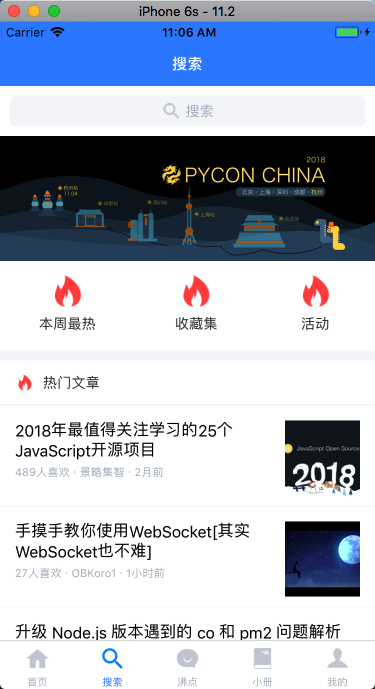
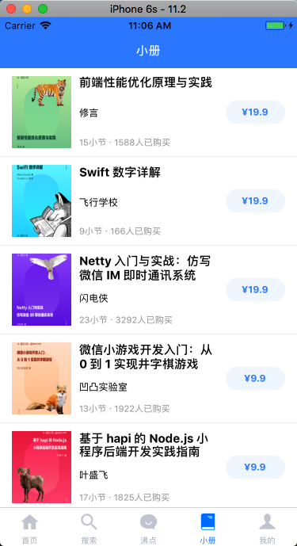
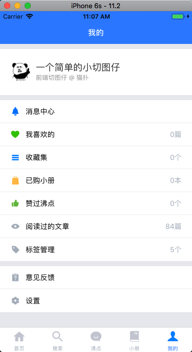
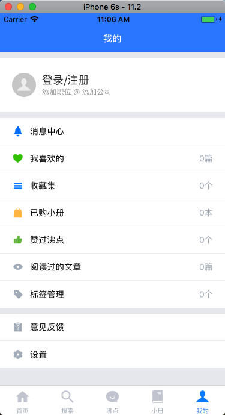

## Build Setup

# install dependencies
npm install or yarn install

# serve with hot reload at localhost:8081
npm start

**首页登录和未登录：**  
  


**搜索页面：**  


**小册页面：**  


**我的页面登录和未登陆：**  
  


**标签页面：**  


```bash
├── App.js
├── App.test.js
├── README.md
├── api
│   └── index.js
├── app.json
├── pages
│   ├── AuthLoadingScreen.js
│   ├── Boiling.js // 沸点
│   ├── Home.js // 首页
│   ├── ItemDetail.js // 详情页
│   ├── Login.js // 登录
│   ├── My.js // 个人中心
│   ├── Quiz.js // 小册
│   ├── Search.js // 搜索
│   ├── component // 公共组件
│   │   ├── EmptyComponent.js
│   │   ├── FlatListFooterComponent.js
│   │   ├── ItemTouchableOpacity.js
│   │   ├── LabelItem.js
│   │   └── RenderItem.js
│   ├── myPage
│   │   ├── About.js
│   │   ├── Collect.js
│   │   ├── HasRead.js
│   │   ├── Label.js
│   │   ├── Like.js
│   │   ├── Notice.js
│   │   ├── Praise.js
│   │   ├── Purchased.js
│   │   ├── Set.js
│   │   ├── Statistics.js
│   │   ├── Suggest.js
│   │   └── UserInfo.js
│   └── styles
│       └── itemStyle.js
├── router
│   ├── index.js
│   └── myScreen.js
├── store // mobx
│   ├── index.js
│   └── modules
│       ├── boiling.js
│       ├── hasRead.js
│       ├── home.js
│       ├── itemDetail.js
│       ├── label.js
│       ├── login.js
│       ├── my.js
│       ├── notice.js
│       ├── quiz.js
│       ├── search.js
│       └── userInfo.js
├── utils
│   ├── global.js
│   └── valate.js
├── yarn-error.log
└── yarn.lock

27 directories, 129 files
